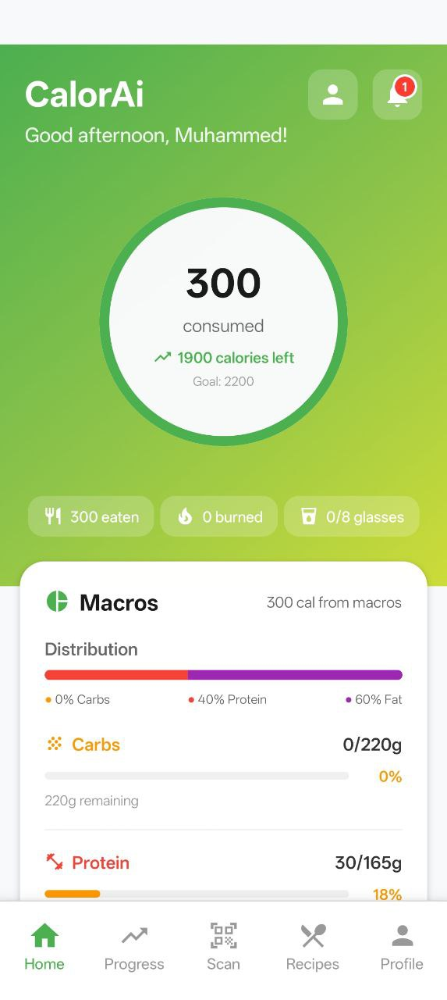
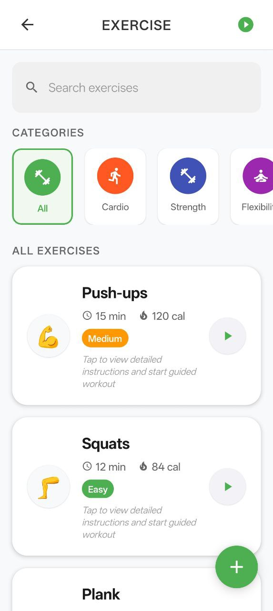
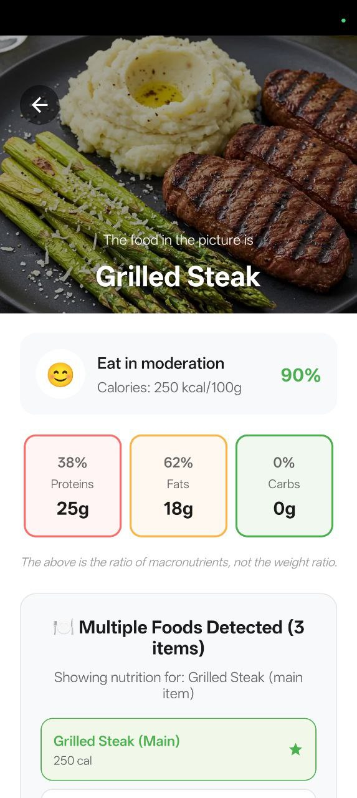
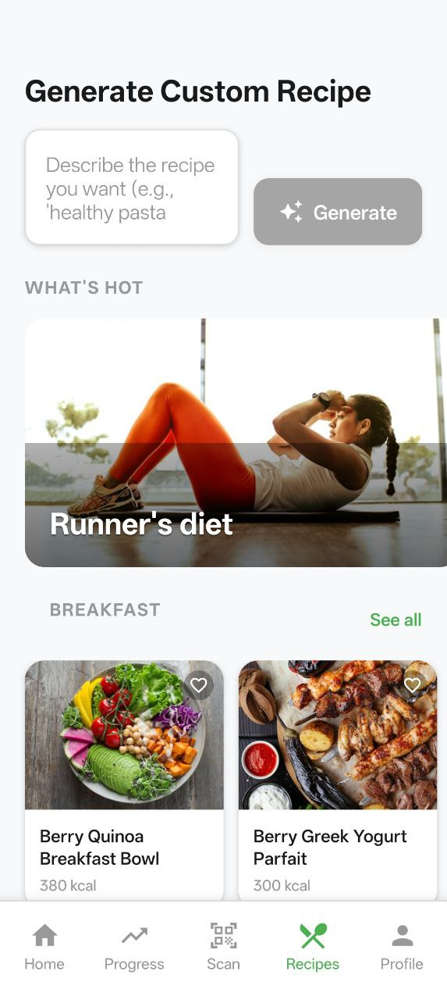
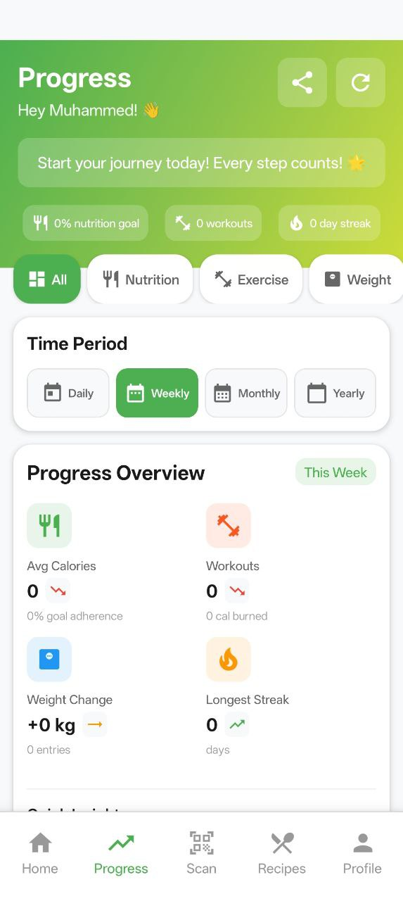
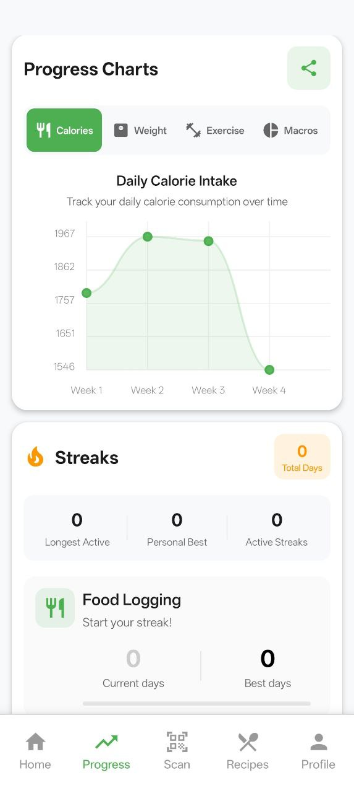
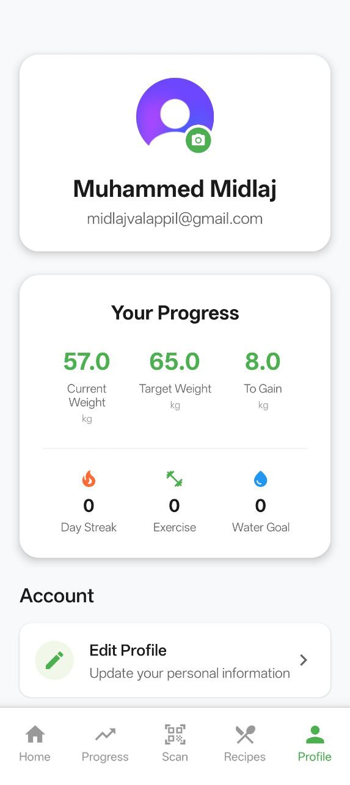

# 🥗 CalorAi - AI-Powered Nutrition Tracking App

<div align="center">


[](https://reactnative.dev/)
[](https://expo.dev/)
[](https://www.typescriptlang.org/)
[](LICENSE)

**A comprehensive nutrition tracking mobile app with AI-powered food recognition, exercise tracking, and personalized meal planning.**

[Features](#-features) • [Screenshots](#-screenshots) • [Installation](#-installation) • [Tech Stack](#-tech-stack) • [Build](#-build-instructions)

</div>

---

## 📱 About CalorAi

CalorAi is a modern, AI-powered nutrition tracking mobile application designed to help users achieve their health and fitness goals. Built with React Native and Expo, the app combines cutting-edge AI technology with an intuitive, Lifesum-inspired design to provide a seamless nutrition tracking experience.

### 🎯 Key Highlights

- **AI-Powered Food Recognition**: Scan food with your camera and get instant nutritional information using Google Gemini Vision API
- **Comprehensive Exercise Library**: 10 different workout routines with guided instructions and progress tracking
- **Smart Recipe Generation**: AI-generated recipes based on your dietary preferences and goals
- **Advanced Analytics**: Detailed progress tracking with interactive charts and streak monitoring
- **Personalized Experience**: Custom nutrition goals calculated using AI-powered BMR/TDEE algorithms
- **Native Mobile Experience**: Optimized for Android with platform-specific styling and performance

---

## ✨ Features

### 🍎 Nutrition Tracking
- **Smart Food Scanning**: Use your camera to instantly recognize food and get detailed nutritional information
- **Comprehensive Food Database**: Access to extensive nutrition data with macro and micronutrient breakdowns
- **Meal Logging**: Track breakfast, lunch, dinner, and snacks with detailed calorie and macro information
- **Water Tracking**: Monitor daily hydration with visual progress indicators

### 🏋️‍♀️ Exercise & Fitness
- **10 Exercise Routines**: Complete workout library including:
  - 💪 Push-ups (Strength)
  - 🦵 Squats (Strength)
  - 🏋️‍♀️ Plank (Core)
  - 🤸‍♂️ Jumping Jacks (Cardio)
  - 🔥 Burpees (HIIT)
  - ⛰️ Mountain Climbers (Cardio)
  - 🚶‍♀️ Lunges (Strength)
  - 🧘‍♀️ Yoga Flow (Flexibility)
  - 🏃‍♀️ High Knees (Cardio)
  - 💺 Tricep Dips (Strength)
- **Guided Workouts**: Step-by-step instructions with timers and progress tracking
- **Exercise Analytics**: Track workout frequency, duration, and calories burned

### 🤖 AI-Powered Features
- **Google Gemini Vision Integration**: Advanced food recognition and nutritional analysis
- **Smart Recipe Generation**: AI-created recipes based on your dietary preferences and restrictions
- **Personalized Nutrition Goals**: AI-calculated BMR/TDEE for accurate calorie and macro targets
- **Intelligent Recommendations**: Personalized meal and exercise suggestions

### 📊 Progress & Analytics
- **Interactive Charts**: Visual representation of nutrition and fitness progress
- **Streak Tracking**: Monitor consistency with daily tracking streaks
- **Goal Monitoring**: Track progress towards weight, nutrition, and fitness goals
- **Historical Data**: Comprehensive history of meals, workouts, and progress metrics

---

## 📸 Screenshots

<div align="center">

### 🏠 Dashboard & Nutrition Tracking


*Main dashboard showing daily nutrition goals, calorie tracking, and macro breakdown with Lifesum-inspired design*

### 🏋️‍♀️ Exercise Library & Workouts


*Complete exercise library with 10 different workouts, each with detailed instructions and difficulty levels*

### 📷 AI-Powered Food Scanning


*Smart food recognition using Google Gemini Vision API for instant nutritional analysis*

</div>

<div align="center">

### 🍳 Recipe Generation & Management


*AI-generated recipes with detailed nutritional information and cooking instructions*

### 📊 Progress Analytics & Charts
 

*Comprehensive progress tracking with interactive charts, streak monitoring, and goal achievement metrics*

### 👤 User Profile & Settings


*Personalized user profile with preferences, nutrition settings, and account management*

</div>

---

## � Tech Stack

### Frontend & Mobile
- **React Native** `0.79.3` - Cross-platform mobile development
- **Expo** `53.0.10` - Development platform and build tools
- **TypeScript** `5.3.3` - Type-safe JavaScript development
- **Expo Router** - File-based navigation system

### UI & Design
- **React Native Paper** - Material Design components
- **React Native Reanimated** - High-performance animations
- **React Native Gesture Handler** - Touch and gesture handling
- **Custom Components** - Lifesum-inspired design system with #4CAF50 green theme

### Authentication & Backend
- **Clerk** - User authentication and management
- **Supabase** - Backend-as-a-Service with real-time database
- **AsyncStorage** - Local data persistence

### AI & APIs
- **Google Gemini Vision API** - AI-powered food recognition
- **Google Gemini API** - Recipe generation and nutrition analysis
- **Expo Camera** - Camera integration for food scanning

### Development & Build
- **EAS Build** - Cloud-based build service
- **Metro** - JavaScript bundler with platform-specific optimizations
- **ESLint & Prettier** - Code quality and formatting

---

## 🚀 Installation

### Prerequisites
- **Node.js** (v18 or later)
- **npm** or **yarn**
- **Expo CLI** (`npm install -g @expo/cli`)
- **Android Studio** (for Android development)
- **Xcode** (for iOS development, macOS only)

### Quick Start

1. **Clone the repository**
   ```bash
   git clone https://github.com/midlaj-muhammed/CalorAi-App.git
   cd CalorAi-App
   ```

2. **Install dependencies**
   ```bash
   npm install
   ```

3. **Set up environment variables**
   ```bash
   cp .env.example .env
   ```

   Configure your API keys in `.env`:
   ```env
   EXPO_PUBLIC_CLERK_PUBLISHABLE_KEY=your_clerk_key_here
   EXPO_PUBLIC_SUPABASE_URL=your_supabase_url_here
   EXPO_PUBLIC_SUPABASE_ANON_KEY=your_supabase_anon_key_here
   EXPO_PUBLIC_GEMINI_API_KEY=your_gemini_api_key_here
   ```

4. **Start the development server**
   ```bash
   npm start
   ```

5. **Run on your device**
   - **iOS**: Press `i` for iOS simulator
   - **Android**: Press `a` for Android emulator
   - **Physical Device**: Scan QR code with Expo Go app

---

## 📱 Build Instructions

### Development Builds

```bash
# Start development server
npm start

# Clear cache and restart
npm run clean
```

### Production Builds

#### Android APK (for testing)
```bash
npm run build:android:preview
```

#### Android App Bundle (for Play Store)
```bash
npm run build:android
```

#### iOS Build
```bash
npm run build:ios
```

### EAS Build Commands

```bash
# Build for all platforms
npm run build:all

# Preview build (APK)
eas build --platform android --profile preview

# Production build (AAB)
eas build --platform android --profile production
```

---

## 🔧 Recent Fixes & Updates

### ✅ Exercise Menu Navigation Fix
- **Issue**: All exercises were opening push-ups regardless of selection
- **Solution**: Implemented dynamic exercise data retrieval based on exercise ID
- **Impact**: All 10 exercises now open their correct details and workout screens

### ✅ Android Web Interface Optimization
- **Issue**: Android app was displaying with web-like interface instead of native mobile UI
- **Solution**: Added comprehensive platform detection utilities and mobile-first styling
- **Features Added**:
  - Platform detection with fallbacks (`utils/platformUtils.ts`)
  - Mobile-optimized layouts with 44px minimum touch targets
  - Responsive typography and spacing
  - Native Android styling and behaviors

### ✅ Configuration & Dependencies
- **Updated**: All Expo SDK packages to latest compatible versions
- **Fixed**: EAS build configuration for proper Android builds
- **Added**: Comprehensive `.gitignore` for sensitive files and build artifacts
- **Optimized**: Metro bundler configuration for platform-specific builds

---

## 📁 Project Structure

```
CalorAi-App/
├── app/                          # Expo Router pages
│   ├── (auth)/                   # Authentication screens
│   ├── (onboarding)/             # Onboarding flow
│   ├── (tabs)/                   # Main app tabs
│   ├── exercise/                 # Exercise screens
│   │   ├── [id].tsx             # Exercise details
│   │   └── workout/[id].tsx     # Workout sessions
│   └── _layout.tsx              # Root layout
├── components/                   # Reusable UI components
│   ├── ui/                      # Basic UI components
│   ├── charts/                  # Chart components
│   └── forms/                   # Form components
├── contexts/                     # React Context providers
│   ├── NutritionContext.tsx     # Nutrition data management
│   ├── ProgressContext.tsx      # Progress tracking
│   └── OnboardingContext.tsx    # Onboarding state
├── utils/                       # Utility functions
│   ├── platformUtils.ts         # Platform detection & styling
│   └── calculations.ts          # BMR/TDEE calculations
├── assets/                      # Static assets
├── screenshots/                 # App screenshots
└── docs/                       # Documentation
```

---

## 🎯 Key Features Breakdown

### 🍎 Nutrition Tracking
- **Daily Calorie Goals**: AI-calculated based on user profile and goals
- **Macro Tracking**: Protein, carbs, fats with visual progress indicators
- **Meal Logging**: Breakfast, lunch, dinner, and snacks tracking
- **Water Intake**: Hydration monitoring with 250ml glass measurements

### 🏋️‍♀️ Exercise Library
1. **Push-ups** 💪 - Upper body strength
2. **Squats** 🦵 - Lower body strength
3. **Plank** 🏋️‍♀️ - Core stability
4. **Jumping Jacks** 🤸‍♂️ - Cardio conditioning
5. **Burpees** 🔥 - Full body HIIT
6. **Mountain Climbers** ⛰️ - Cardio endurance
7. **Lunges** 🚶‍♀️ - Leg strength
8. **Yoga Flow** 🧘‍♀️ - Flexibility
9. **High Knees** 🏃‍♀️ - Cardio conditioning
10. **Tricep Dips** 💺 - Upper body strength

### 🤖 AI Integration
- **Food Recognition**: Google Gemini Vision for instant food identification
- **Recipe Generation**: AI-created recipes based on preferences
- **Nutrition Analysis**: Detailed macro and micronutrient breakdowns
- **Goal Calculation**: Personalized BMR/TDEE calculations

---

## 🚀 Contributing

We welcome contributions to CalorAi! Please follow these steps:

1. **Fork the repository**
2. **Create a feature branch** (`git checkout -b feature/amazing-feature`)
3. **Commit your changes** (`git commit -m 'Add amazing feature'`)
4. **Push to the branch** (`git push origin feature/amazing-feature`)
5. **Open a Pull Request**

### Development Guidelines
- Follow TypeScript best practices
- Use the existing component structure
- Maintain the Lifesum-inspired design aesthetic
- Test on both Android and iOS platforms
- Update documentation for new features

---

## 📄 License

This project is licensed under the MIT License - see the [LICENSE](LICENSE) file for details.

---

## 👨‍💻 Author

**Muhammed Midlaj**
- GitHub: [@midlaj-muhammed](https://github.com/midlaj-muhammed)
- Email: 96953353+midlaj-muhammed@users.noreply.github.com

---

## 🙏 Acknowledgments

- **Lifesum** - Design inspiration for the clean, modern UI
- **Google Gemini** - AI-powered food recognition and recipe generation
- **Expo Team** - Excellent development platform and tools
- **React Native Community** - Amazing ecosystem and components

---

<div align="center">

**⭐ Star this repository if you find it helpful!**

[Report Bug](https://github.com/midlaj-muhammed/CalorAi-App/issues) • [Request Feature](https://github.com/midlaj-muhammed/CalorAi-App/issues) • [Documentation](./docs/)

</div>
